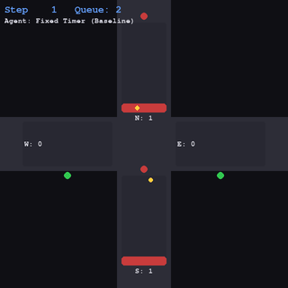
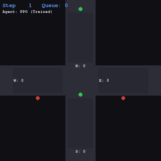

# 🚦 Traffic Signal Control with Reinforcement Learning

A custom **Gymnasium environment** simulating a 4-way traffic intersection, where a **PPO agent** (Proximal Policy Optimization) learns to minimize vehicle wait times — outperforming a naive fixed-timer baseline.

---

## Demo

| Fixed-Timer Baseline | PPO Agent (Trained) |
|:--------------------:|:-------------------:|
|  |  |

> The PPO agent learns to prioritize congested lanes dynamically, rather than blindly alternating green phases.

---

## Results

After training for **200,000 timesteps** on CPU:

| Metric | Fixed-Timer | PPO Agent | Improvement |
|--------|-------------|-----------|-------------|
| Avg Queue Length | ~X.XX | ~X.XX | **X% reduction** |
| Episode Reward | ~-XXX | ~-XXX | ↑ |
| Total Wait | ~XXXX | ~XXXX | ↓ |

> Fill in values from running `python evaluate.py`

---

## Environment

Built from scratch using the [Gymnasium](https://gymnasium.farama.org/) API.

- **Observation space** `(8,)` — queue lengths + cumulative waits for all 4 lanes (N, S, E, W)
- **Action space** `Discrete(4)` — which lane group gets the green light
- **Reward** — negative total queue length per step (agent minimises congestion)
- **Episode length** — 500 steps, cars spawn randomly each step with configurable probability

---

## Project Structure

```
traffic-rl/
├── env/
│   └── traffic_env.py    # Custom Gymnasium environment
├── train.py              # PPO training via Stable-Baselines3
├── visualize.py          # Pygame renderer + GIF recorder
├── evaluate.py           # Baseline comparison + metrics plot
└── requirements.txt
```

---

## Getting Started

**1. Clone and set up environment**
```bash
git clone https://github.com/Pranjal-agl/traffic-rl-ppo.git
cd traffic-rl-ppo
python3 -m venv venv
source venv/bin/activate
pip install -r requirements.txt
```

**2. Train the PPO agent**
```bash
python train.py
```
Training takes ~5 minutes on CPU. Best model is saved to `models/best_model.zip`.

**3. Evaluate against baseline**
```bash
python evaluate.py
```
Runs 20 episodes each and prints queue reduction %. Saves `metrics.png`.

**4. Watch the agent**
```bash
python visualize.py              # trained PPO agent → saves agent_demo.gif
python visualize.py --baseline   # fixed-timer baseline → saves baseline_demo.gif
```

---

## Tech Stack

- **Python 3.12**
- [Gymnasium](https://gymnasium.farama.org/) — custom RL environment
- [Stable-Baselines3](https://stable-baselines3.readthedocs.io/) — PPO implementation
- [Pygame](https://www.pygame.org/) — real-time visualization
- [Matplotlib](https://matplotlib.org/) — evaluation plots

---

## Key Concepts

- **PPO (Proximal Policy Optimization)** — on-policy actor-critic algorithm that clips gradient updates for stable training
- **Custom Gym Environment** — implements `reset()`, `step()`, `observation_space`, and `action_space` per the Gymnasium API
- **Baseline Comparison** — fixed-timer alternates green phases every 10 steps regardless of queue state; PPO adapts dynamically

---

## Related Projects

This project is thematically linked to [quantum-traffic-routing](https://github.com/Pranjal-agl/quantum-traffic-routing) — which explores the same traffic optimization problem using QAOA on a quantum computing framework.
